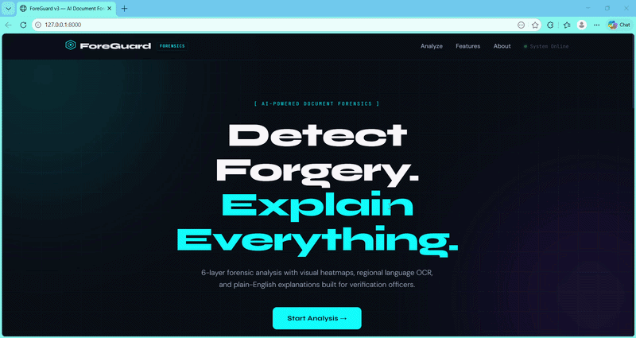

# ForeGuard – Document Forgery Detection System
An Explainable Document Forgery Detection System using Computer Vision, OCR, and FastAPI

---

## Overview

ForeGuard is a document forgery detection system developed using **Python**, **FastAPI**, **OpenCV**, and **EasyOCR**. The system analyzes uploaded documents using multiple detection techniques to identify possible tampering, edited regions, font inconsistencies, metadata changes, and suspicious modifications.

The platform generates explainable reports with confidence scores, extracted text, annotated suspicious regions, and multilingual OCR support.

---

# Features

- Document Forgery Detection
- Error Level Analysis (ELA)
- Font Inconsistency Detection
- Layout Analysis
- Metadata Analysis
- OCR Text Extraction
- Multi-language Support
- Explainable Analysis Reports
- Confidence Score Generation
- Heatmap Visualization
- FastAPI REST API
- Real-time Analysis

---

# Tech Stack

| Technology | Purpose |
|---|---|
| Python | Backend Development |
| FastAPI | REST API Framework |
| Uvicorn | Backend Server |
| OpenCV | Computer Vision Processing |
| Pillow (PIL) | Image Processing |
| EasyOCR | OCR Text Extraction |
| NumPy | Numerical Operations |
| PyMuPDF | PDF Processing |
| HTML5 | Frontend Structure |
| CSS3 | Styling |
| JavaScript | Frontend Functionality |

---

# Preview

<p align="center">
  
</p>

---

# Core Detection Modules

## Error Level Analysis (ELA)

Detects image editing artifacts and compression inconsistencies by comparing the original and recompressed image.

---

## Font Analysis

Identifies font mismatches, altered characters, and replaced text regions inside documents.

---

## Layout Analysis

Detects structural inconsistencies such as alignment issues, overwritten areas, and white patch regions.

---

## Metadata Analysis

Extracts and analyzes hidden image metadata including timestamps and editing software information.

---

## OCR and Language Detection

Extracts visible text from documents and supports multiple languages using EasyOCR.

Supported Languages:
- English
- Tamil
- Hindi
- Telugu
- Kannada
- Bengali
- Marathi
- Gujarati
- Arabic
- Chinese
- Japanese
- Korean

---

# Project Structure

```bash
foreguard-main/
│
├── backend/
│   ├── app/
│   │   ├── main.py
│   │   ├── config.py
│   │   ├── detectors/
│   │   ├── models/
│   │   └── utils/
│   │
│   ├── uploads/
│   ├── reports/
│   └── requirements.txt
│
├── frontend/
│   ├── index.html
│   ├── css/
│   └── js/
│
├── README.md
├── LICENSE
└── start.bat
```

---

# Workflow

1. User uploads a document
2. Backend receives the file through FastAPI
3. Multiple forgery detectors analyze the document
4. Confidence score is generated
5. Explainable report is created
6. Results are displayed on the frontend dashboard

---

# API Endpoints

## POST `/analyze`

Uploads and analyzes documents.

### Output
- Confidence Score
- Risk Level
- OCR Extracted Text
- Detector Findings
- Annotated Images

---

## GET `/health`

Checks server status.

### Response

```json
{
  "status": "ok"
}
```

---

# Installation

## 1. Clone the Repository

```bash
git clone <repository_link>
```

---

## 2. Navigate to the Project Folder

```bash
cd foreguard-main
```

---

## 3. Install Dependencies

```bash
cd backend
pip install -r requirements.txt
```

---

## 4. Start the Backend Server

```bash
python -m uvicorn app.main:app --reload --port 8000
```

---

## 5. Open the Application

```bash
http://localhost:8000
```

---

# Advantages

- Faster than manual verification
- Supports multiple document formats
- Easy-to-use interface
- Explainable outputs improve trust
- Supports multilingual documents
- Real-time document analysis

---

# Future Improvements

- Deep Learning-based Forgery Detection
- Cloud Deployment
- Mobile Application Support
- User Authentication System
- Database Integration
- Webcam-based Real-time Scanning

---

# Learning Outcomes

This project helped in understanding:

- Computer Vision
- OCR Processing
- FastAPI Backend Development
- Image Processing
- Explainable Systems
- REST API Development
- Frontend Integration
- File Handling in Python

---

# Author

**Akshaya SK**

Artificial Intelligence And Machine Learning

---

# License

This project is licensed under the MIT License.
